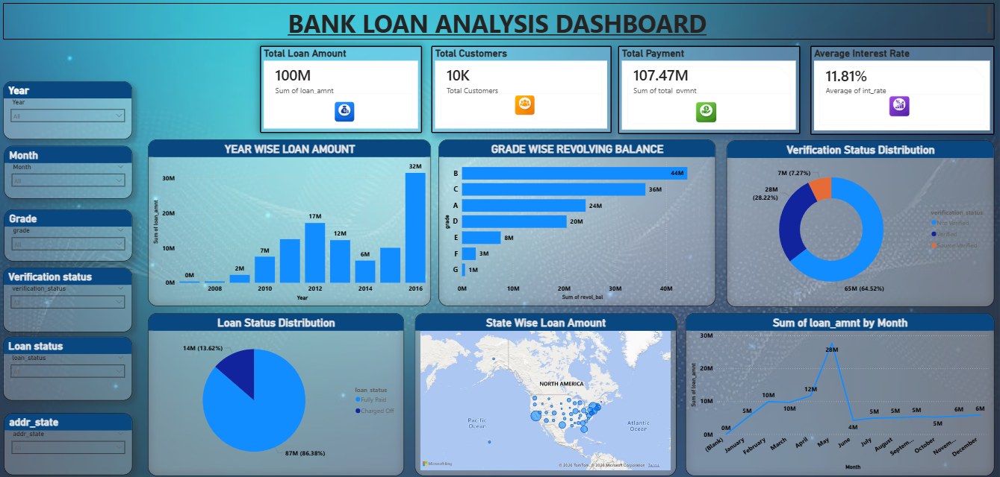

# 🏦 Bank Loan Analysis Dashboard

## 📌 Project Overview

This project is an interactive Power BI dashboard built to analyze bank loan data and monitor loan performance, customer behavior, and lending trends.

The dashboard provides insights into total loan applications, funded amount, amount received, loan status, interest rate, and customer demographics.

---

## 📊 Dashboard Preview

---

## 🎯 Objectives

- Analyze loan applications
- Track funded and received amounts
- Monitor loan status
- Understand customer demographics
- Identify lending trends

---

## 📈 KPIs

- Total Loan Applications
- Total Funded Amount
- Total Amount Received
- Average Interest Rate
- Average DTI
- Good Loan Percentage
- Bad Loan Percentage

---

## 📊 Dashboard Features

- Loan Status Analysis
- Monthly Loan Trend
- State-wise Loan Distribution
- Loan Purpose Analysis
- Home Ownership Analysis
- Employee Length Analysis
- Term Analysis

---

## 🛠 Tools Used

- Power BI
- Power Query
- DAX
- Excel

---

## 📂 Files Included

- Dashboard.png
- Bank_Loan_Analysis.pbix
- bank_loan_data.csv

---

## 👩‍💻 Created By

Sayali Kasab

GitHub:
https://github.com/Sayalikasab
